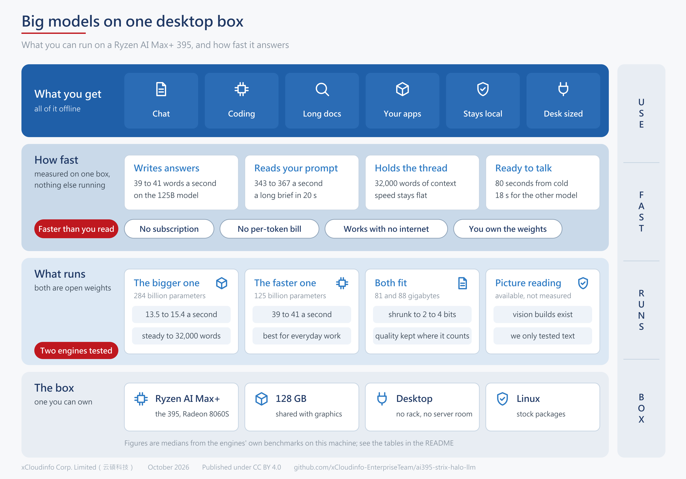
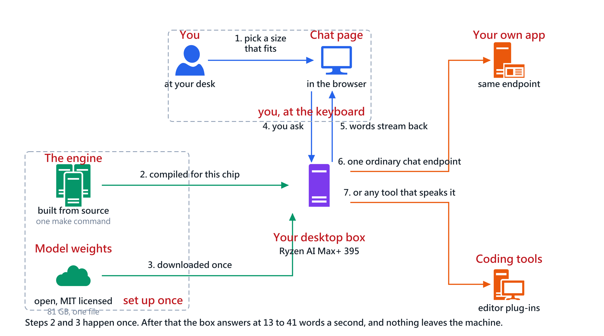

# 用AMD AI 395（Strix Halo）跑大模型

[English](README.md) ｜ **繁體中文**

這份記錄的是在一台**Ryzen AI Max+ PRO 395**桌機上跑大型混合專家模型的實測數字與版本陷阱。
這顆晶片的其他叫法有**Strix Halo**、**AI 395**、**gfx1151**，顯示核心是**Radeon 8060S**，
配**128GB統一記憶體**。

兩套引擎、兩顆模型、一台機器，量測時機器上沒有跑別的東西。下面每個數字都是量出來的，不是估的。




## 先講結論

一顆2,840億參數的模型在這台上每秒吐13.5到15.4個token，1,250億參數的那顆是39到41個。
兩顆都撐得住32,000個token的上下文而且速度幾乎不掉，而且全程不連外網。

**這比多數人閱讀的速度還快。** 也就是說這台足以當個人AI引擎用：對談、起草、寫程式、
問長文件，或者掛在自己的應用後面透過一般的對話端點呼叫。沒有訂閱費、沒有按token計價、
資料不出這台機器。

## 這台機器

| | |
|---|---|
| 處理器 | AMD Ryzen AI Max+ PRO 395，32執行緒，支援AVX-512 |
| 顯示核心 | Radeon 8060S，RDNA 3.5，`gfx1151`，40個運算單元 |
| 記憶體 | 128GB LPDDR5X統一記憶體——96GiB由BIOS劃給顯示核心，作業系統看得到31GB |
| GTT共享池 | 不加開機參數時是15.6GiB |
| 作業系統 | Ubuntu 24.04.4，核心6.17.0-35-generic |
| 驅動 | amdgpu 6.16.6（DKMS），ROCm 7.1.1（發行版套件） |

## DwarfStar配DeepSeek-V4-Flash

引擎是[`antirez/ds4`](https://github.com/antirez/ds4)，模型檔
`DeepSeek-V4-Flash-IQ2XXS-w2Q2K-AProjQ8-SExpQ8-OutQ8-chat-v2-imatrix-0731.gguf`，81GB。

```
make strix-halo
./download_model.sh ds4f-q2
./ds4-server --rocm --host 0.0.0.0 --port 8081 --cors
```

它自己在context 32768時報的記憶體配置是
`KV 0.78 GiB（raw 0.36＋compressed 0.42）＋buffers 0.25 GiB＋resident model 80.76 GiB
＝81.79 GiB planned`，而且80.76GiB的張量**17.7秒**就映射完。

`ds4-bench --rocm`跨context量到的：

| context | 提示處理 tok/s | 產出 tok/s | KV位元組 |
|--------:|------------:|---------:|-------:|
| 2,048 | 142.30 | 15.40 | 52,184,460 |
| 4,096 | 166.64 | 14.44 | 80,373,132 |
| 8,192 | 163.97 | 14.25 | 136,750,476 |
| 16,384 | 158.86 | 14.02 | 249,505,164 |
| 24,576 | 154.34 | 13.78 | 362,259,852 |
| 32,768 | 150.11 | 13.52 | — |

從2K到32K產出速度只掉12%，提示處理則幾乎不變。

**編譯需要改一行才過。** `rocm/ds4_rocm_deepseek4_vision.cuh`在主機端呼叫`rsqrtf()`，
而HIP只把它宣告成`__device__`專用，所以CUDA編得過、ROCm編不過。
修正已送出：[antirez/ds4#1193](https://github.com/antirez/ds4/pull/1193)。

## Strata配Qwen3.8-Flash-Next

引擎是[`Niko1221/Strata`](https://github.com/Niko1221/Strata) 0.1.40，
模型`Qwen3.8-Flash-Next UD-IQ4_XS`，88GB，用系統的ROCm編。

| | 一次一個請求 | 兩個並行 |
|---|---|---|
| 產出 | 39.0到40.9 tok/s | 各30.4 tok/s |
| 提示處理（6,786 token的prompt） | 343到367 tok/s | 未量 |
| 冷啟動載入 | 80秒 | 80秒 |

加`--expert-cache 16384`之後它把23,550個專家區塊放在顯示記憶體裡，
回報**99.6%命中率**與`no file reads`——產生的過程完全沒有從磁碟串流。

## 為什麼塞得下

兩套引擎都沒有什麼祕密，它們用的是同樣三個已經公開、而且有正式名稱的做法，
值得把名字寫出來讓你自己去查：

**依張量角色做混合精度。** 熱路徑——注意力投影、共享專家、輸出頭——維持8位元；
路由專家佔掉檔案大部分體積但很少被動到，壓到2位元。
DeepSeek那個檔名就是配方本身：`IQ2XXS-w2Q2K-AProjQ8-SExpQ8-OutQ8`。

**專家快取。** 混合專家模型每個token只會啟動少數幾個專家，
所以把常用的放在快的記憶體裡，其餘的要用再讀。

**推測解碼。** 一個小的草稿頭先提議幾個token，主模型一次驗證。
Strata在我們的prompt上回報草稿接受率68%。

## 四件花掉我們時間的事

**最新的ROCm不是對的ROCm。** DwarfStar與Strata的文件都指向AMD的TheRock建置。
但TheRock的ROCm 7.14.1跟這顆核心裡的amdgpu 6.16.6不相容：
`hipMalloc`會成功、`hipGetDeviceCount`與`hipMemGetInfo`也會成功，
然後`hipMemcpy`從主機複製1MiB到裝置就回`invalid argument`。
同一台機器、同一顆顯示核心、同一支程式，換成系統的ROCm 7.1.1就完全沒事。

**確認「顯示核心有被認出來」不能證明任何事。** 在你怪罪模型、量化或編譯旗標之前，
先跑[`hip_memcpy_check.c`](hip_memcpy_check.c)。

**機器被共用會掉4.5倍。** 同一套引擎、同一組設定量兩次：
另一顆模型的worker佔著41GiB顯示記憶體與23GB系統記憶體時是8.7 tok/s，
機器獨佔時是**39.0 tok/s**，專家快取命中率同時從85.1%升到99.6%。
這顆晶片的限制是記憶體頻寬不是容量，**所以在共用機器上量到的數字不算數**。
這份文件裡的每個數字都是獨佔時量的。

**amdgpu是DKMS模組而且沒有核心版本上限。** 它的`dkms.conf`是`AUTOINSTALL="yes"`
且沒有`BUILD_EXCLUSIVE_KERNEL`，所以裝新核心時它會去硬編，編失敗也不會有人攔你重開機，
重開之後就沒有顯示核心可用。這就是`amdgpu-install`把HWE核心套件鎖住的原因。
要升級之前先只裝標頭檔、用`dkms build`乾跑一次，**不要先裝核心映像**。

**那18個gfx1151專用的加速開關在這裡量不出差別。** Strata預設會開啟18個針對這個架構的開關。
我們量過全開、每組單獨開、以及全關：產出速度在每一種情況下都落在8.7到8.9 tok/s之間，
而且全關那一組還稍微最快。我們也間歇性地遇到`unspecified launch failure`——
同一組設定會過也會炸，而且回報的層數會變——所以**一組設定跑一輪的實驗設計無法歸因到任何開關**。
同樣的錯誤簽章在這顆晶片上跑llama.cpp時也會出現，所以不是哪一套引擎的問題。

## 實際上怎麼用



## 怎麼重現

`hip_memcpy_check.c`是那支相容性測試。`docs/make_arch.py`與`docs/make_flow.py`產生這兩張圖。
引擎的效能數字都是引擎自己的工具量的：ds4是
`ds4-bench --rocm --chat-prompt-file <至少32768個token的prompt>`，
Strata則是它伺服器log裡每個請求的計時。

## 致謝與授權

兩套引擎都是別人的作品，而且都是MIT授權：
[DwarfStar](https://github.com/antirez/ds4)作者Salvatore Sanfilippo，
以及[Strata](https://github.com/Niko1221/Strata)。
模型是[DeepSeek](https://huggingface.co/deepseek-ai)與[Qwen](https://huggingface.co/Qwen)，
同樣MIT。**這個repo貢獻的是實測數字、一份版本相容性對照、以及一個送上游的修補——不是一項技術。**

由[云碩科技股份有限公司（xCloudinfo）](https://hf.co/xCloudinfo)發布。
文字、表格與圖採[CC BY 4.0](LICENSE)；程式碼檔案（`hip_memcpy_check.c`與`docs/`底下的產圖腳本）
另外採[MIT授權](LICENSE-CODE)，可以直接複製進你自己的專案。
歡迎指正，也歡迎其他Strix Halo機器的數字：開一個issue並附上你的ROCm版本、核心版本、
BIOS劃給顯示核心的大小，以及引擎自己的效能輸出。
